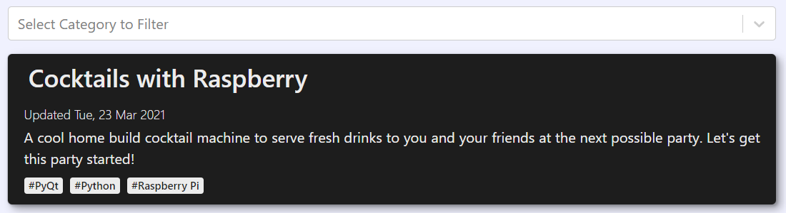
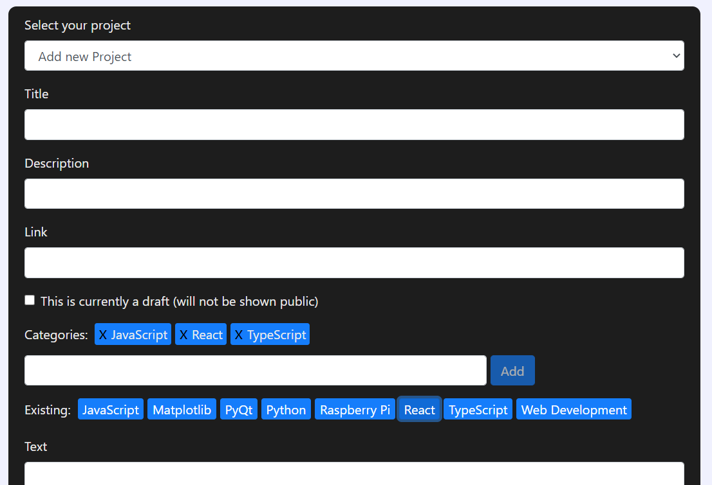
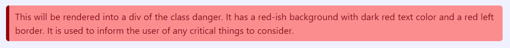

# React Web App with Node.js Backend

This is a React web app with the corresponding backend made with node.js, TypeScript, express, cors and MongoDB.

<!-- TOC -->

- [React Web App with Node.js Backend](#react-web-app-with-nodejs-backend)
- [Features](#features)
  - [Markdown Support](#markdown-support)
- [Architecture](#architecture)
- [Installation](#installation)
  - [Start the Application](#start-the-application)
  - [Access the Application](#access-the-application)
  - [Generate a Admin User](#generate-a-admin-user)
- [ToDo's](#todos)
- [Known Issues](#known-issues)

<!-- /TOC -->

# Features

This project consists of the frontend (`client` folder) and the API (main / `src` folder). The exact architecture is explained in the section below. The site divides between project and blog post. Basically they are quite similar. Project posts are aimed to be more compact and have a link to the refered project, while blog posts go more into the depth and may not be specific to any project. The viewers can filter by category to limit the cards to only show relevant topics. The card will show the title, the description, the categories in alphabetical order and the creation date, or the update date, if updated. In addition, there is also the possibilty to upload and display pictures for artworks or similar topics. Currently there are only two hardcoded topics supported (Fotography and Woodwork).



The Admin user can (while authenticated) edit and add everything over the admin UI. Besides defining the title, the description and the link (only for project posts), there is also the option to define categories. You can either select existing categories or add new ones into your pool. In addition there is the possibility to flag your post as a draft. That will save the posts into the database for later editing but the post will not be available to the user (neither over the website nor over the API, exept for authenticated user).



## Markdown Support

The blog text is writen in Markdown and is parsed into HTML with help of the [remark](https://github.com/remarkjs/remark) parser. In addition, some plugins and custom renders were defined to have even more possibilities.

Features supported in Markdown:

- All native ("vanilla") Markdown features
- Strikethrough, tables, tasklists and direct URLs
- Code syntax highlighting and custom language header
- Latex math expressions (inline and block math)
- Custom colored container (blocks for informative / warning text)

I planned on using `remark-shortcodes` for the custom elements. Sadly I could not get them working. The plugin ran without errors but was not rendering any of my components. So I went another way. I added custom "language" elements to my code blocks. They are currently limited to:

- `danger`: Red themed block element
- `warning`: Yellow themed block element
- `info`: Grey themed block element
- `helpful`: Green themed block element

You simply generate them using the code Markdown syntax with the language defined as the custom name:

````md
```danger
This will be rendered into a div of the class danger. It has a red-ish background with dark red text color and a red left border. It is used to inform the user of any critical things to consider.
```
````

The body within will also be translated from Markdown to HTML code, all supported features can be used. The example above will be translated into the following element:



One critical aspect is to check the right spelling, otherwise the element will rendered into a code block of the misspelled tag.

# Architecture

The following schema shows the architecture of the Web App, API and corresponding services. React is used to build the frontend and gets hosted on github pages. The node.js with express is used for the API and is hosted on heroku. The data is stored in a MongoDB. The blog pages either get the pictures from dropbox or from github. The user and the Admin interacts with the Web App to update data or just view the content:


# Installation

Over npm the server and the client can be installed separately:

```
npm install
cd ./client
npm install
```

## Start the Application

To start the application some variables need to be set fist. This concludes the variables `ATLAS_URI` and `JWT_SECRET` in the `.env` file. Also if you are running everything locally, be sure to set the `ENVIRONMENT_TYPE` to 'dev. The first is the connection string to the database, the second is the 'password' for your token encryption. To get the mongodb running eiter create an instance at [MongoDB Atlas](https://www.mongodb.com/cloud/atlas) or create a local instance with [docker](https://hub.docker.com/_/mongo). The fastes way is to create a volume and image locally with docker (required docker installed):

```
docker volume create --name=yourVolumeName
docker run --name yourMongoDbName -v yourVolumeName:/data/db -p 27017:27017 yourContainerName
```

This will run mongodb on your local port 27017 in docker. In this case (if no credentials are set) the `.env` file would look similar to:

```
ATLAS_URI=mongodb://127.0.0.1:27017
JWT_SECRET=YourSecretForJWT
ENVIRONMENT_TYPE=dev
WHITELIST=yourwebdomainadress
```

You can use the `.env.default` as starting point for your .env file. Yust create a copy and rename it to `.env`. The whitelist can also be a list of domains, separated by a single whitespace (" ").

The same applies to your `.env` files for the frontend / client. The default `.env.development` file contains the adress of the api, this will probably be different in your `.env.production` file, later when running on different servers.

After that you can run both (be sure to be in the main folder), server and backend with:

```
npm run dev
```

This will run both the backend api, and the frontend on local port 5000 and 3000 by default.

## Access the Application

The front end should be opened automatically when running it. Otherwise you can always access it on http://localhost:3000/ when the app is running. The backend API runs on port 5000 by defaul. You can use the `PORT` variable to change the default port. To make calls to the API, other tools like [Postman](https://www.postman.com/) or [Insomnia](https://insomnia.rest/) can be used. To make a call use the http://localhost:5000/api/ endpoint. Since cors will most probably block the call by default, use `"Origin": "http://localhost:3000"` as header.

## Generate a Admin User

By default, at first bootup, the backend will look if any user is found. If there is no existing user, it will create a default user with the name `admin` and the password `adminadmin`. It is strongly recommended to change the password directly after you first login over the admin interface. There is a graphical option for that. You could also use the environment variables `ADMIN_USER` and `ADMIN_PASSWORD` for other initial values than the default ones. Also, you can create additional user over the /api/user/add post enpoint. You will need to be authenticated for that and pass the `username` and `password` in the body.

# ToDo's

- Create a more established style for the whole app
- User Swagger or similar tool for API documentation
- Find a fix for Safari always wrapping code blocks not matter the css
- Update fotos in such way to dynamically be able to generate new categories and create the corresponding elements out of it

# Known Issues

- iOS based browsers do not respect the code cell formatting and break long code lines into multiple ones even if it's defined not to do so.
