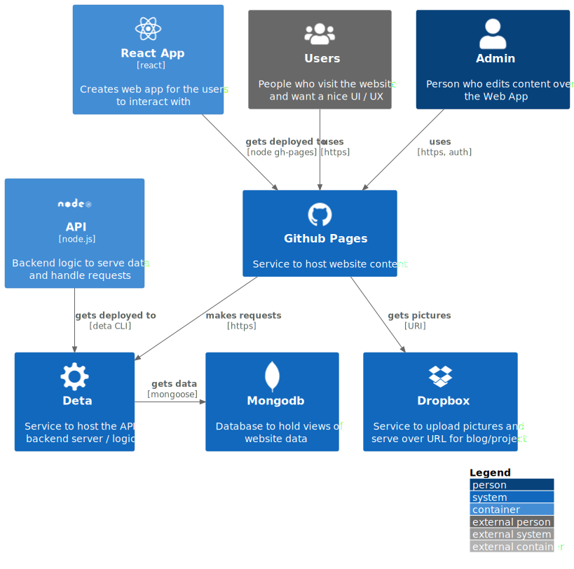

# React Web App with Node.js Backend

This is a React web app with the corresponding backend made with node.js, express, cors and mongodb.

## Architecture

The following schema shows the architecture of the Web App, API and corresponding services. React is used to build the frontend and gets hosted on github pages. The node.js with express is used for the API and is hosted on heroku. The data is stored in a MongoDB. The blog pages either get the pictures from dropbox or from github. The user and the Admin interacts with the Web App to update data or just view the content:



## Installation

Over npm the server and the client can be installed separately:

```
npm install
npm run client-install
```

## Start the application

To start the application some variables need to be set fist. This concludes the variables `ATLAS_URI` and `JWT_SECRET` in the `.env` file. Also if you are running everything locally, be sure to set the `ENVIRONMENT_TYPE` to 'dev. The first is the connection string to the database, the second is the 'password' for your token encryption. To get the mongodb running eiter create an instance at [MongoDB Atlas](https://www.mongodb.com/cloud/atlas) or create a local instance with [docker](https://hub.docker.com/_/mongo). The fastes way is to create a volume and image locally with docker (required docker installed):

```
docker volume create --name=yourVolumeName
docker run --name yourMongoDbName -v yourVolumeName:/data/db -p 27017:27017 yourContainerName
```

This will run mongodb on your local port 27017 in docker. In this case (if no credentials are set) the `.env` file would look similar to:

```
ATLAS_URI=mongodb://127.0.0.1:27017
JWT_SECRET=YourSecretForJWT
ENVIRONMENT_TYPE=dev
WHITELIST=yourwebdomainadress
```

You can use the `.env.default` as starting point for your .env file. The whitelist can also be a list of domains, separated by a single whitespace (" ").

The same applies to your `.env` files for the frontend / client. The default `.env.development` file contains the adress of the api, this will probably be different in your `.env.production` file, later when running on different servers.

After that you can run both, server and backend with:

```
npm run dev
```

This will run both the backend api, and the frontend on local port 5000 and 3000 by default.

## Access the Application

The front end should be opened automatically when running it. Otherwise you can always access it on http://localhost:3000/ when the app is running. The backend API runs on port 5000 by defaul. You can use the `PORT` variable to change the default port. To make calls to the API, other tools like [Postman](https://www.postman.com/) or [Insomnia](https://insomnia.rest/) can be used. To make a call use the http://localhost:5000/api/ endpoint. Since cors will most probably block the call by default, use `"Origin": "http://localhost:3000"` as header.

## Generate a Admin User

By default, at first bootup, the backend will look if any user is found. If there is no existing user, it will create a default user with the name `admin` and the password `adminadmin`. It is strongly recommended to change the password directly after you first login over the admin interface. There is a graphical option for that. You could also use the environment variables `ADMIN_USER` and `ADMIN_PASSWORD` for other initial values than the default ones. Also, you can create additional user over the /api/user/add post enpoint. You will need to be authenticated for that and pass the `username` and `password` in the body.

## ToDo's

- Create a more established style for the whole app
- User Swagger or similar tool for API documentation
- Find a fix for Safari always wrapping code blocks not matter the css
